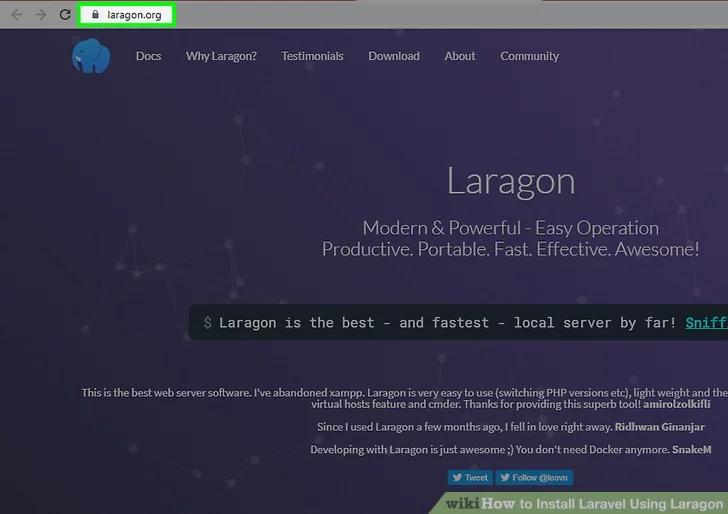
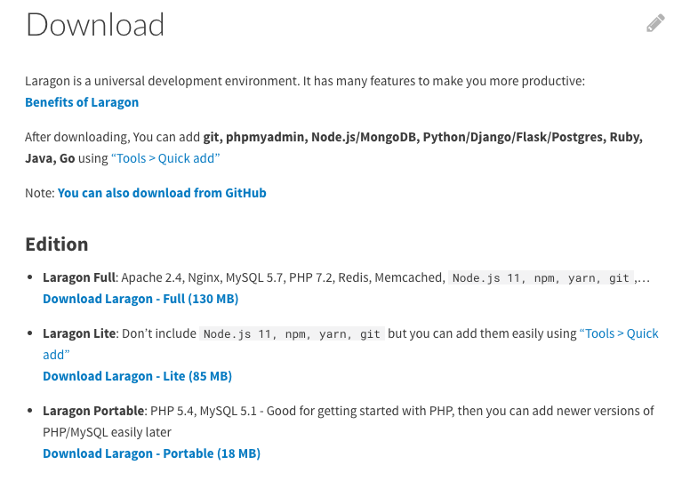
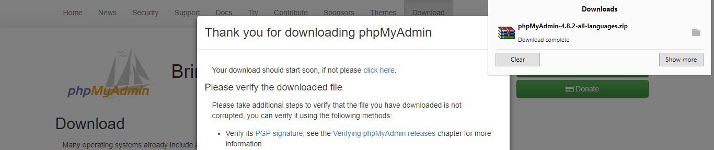
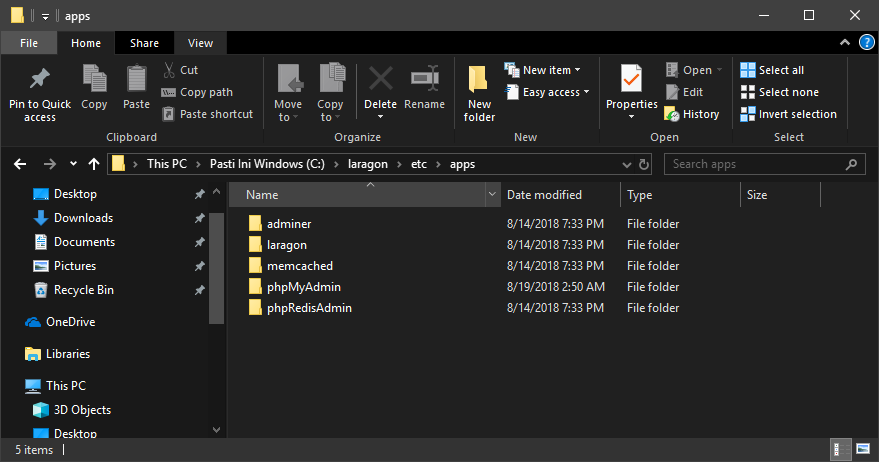
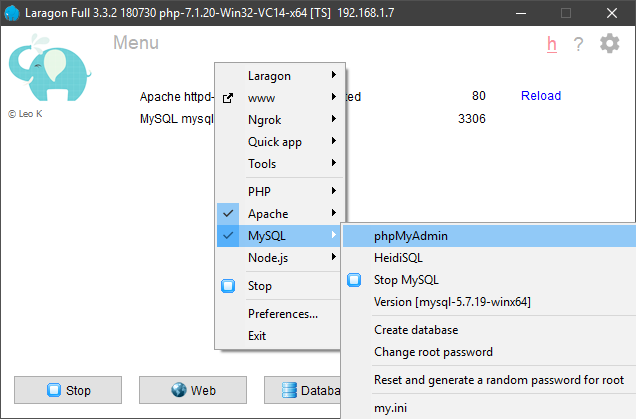
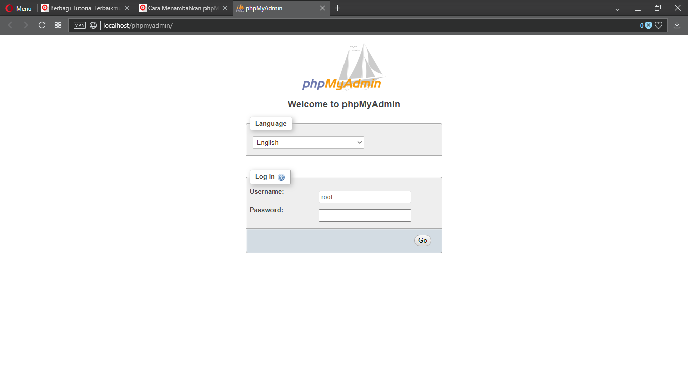
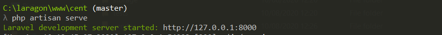

<p align="center"></p>

Solusi dari Kelompok 24 bernama BEBAS adalah sebuah web yang beranama Cent

Dengan anggota dan pembagian tugasnya adalah sebagai berikut:
<p> Kelompok 10 Buddies 1 </p>
	<p> 1. Nicholas Darmawan 16519009 - Front end - Dashboard </p>
	<p> 2. Reihan Andika Putra 16519316 - Back end </p>
	<p> 3. Kadek Dwi Bagus AU 16519350 - Back end </p>
	<p> 4. Karel Renaldi 16519445 - Front end - Login,Register,Forget Password,finishing </p>
	<p> 5. James Chandra 16519446 - Front end - index </p>
	<p> 6. Muhammad Galih R R 16519455 - Front end - add data </p>
	<p> Kelompok 8 Buddies 4 </p>
	<p> 1. Haning Nanda H 16519004 - Penjelasan pemasangan phpMyAdmin dan Laravel</p>
	<p> 2. M Reyhanullah B 165199306 - Penjelasan </p>
	<p> 3. Muhammad Iqbal S 16519349 - Penjelasan cara menjalankan program</p>
	<p> 4. Cindy Amandani N 165199410 - Penjelasan pemasangan Laragon</p>
	<p> 5. Ilyasa Salafi Putra J 16519457 - Penjelasan akses webpage dan login</p>
	<p> 6. Muhammad Asyrofi Al H 16519494</p>


# Cent

Cent adalah sebuah web yang membantu agar penggunanya dapat mengatur keuangan secara proporsional sehingga uang dapat digunakan dengan baik.

<p align="center"></p>

<p align="center">
<a href="https://travis-ci.org/laravel/framework"></a>
<a href="https://packagist.org/packages/laravel/framework"></a>
<a href="https://packagist.org/packages/laravel/framework"></a>
<a href="https://packagist.org/packages/laravel/framework"></a>
</p>

# Requirements

* Laragon
* phpMyAdmin
* Composer

## Instalasi Tools Untuk Laravel

Sebelum kamu dapat melanjutkan tahap Laravel, kamu dapat memasang tools di bawah ini sesuai dengan sistem operasi yang kamu gunakan

Windows

Untuk sistem operasi Windows, tools yang direkomendasikan untuk membuat aplikasi PHP dan Laravel adalah Laragon. Pada laragon, kamu juga dapat memasang aplikasi tanpa harus melakukan instalasi lewat command line
1. Masuk ke website laragon.org lalu klik Download
<p align="center"></p>

2. Pilih Laragon - Full
<p align="center"></p>

3. Install phpMyAdmin
4. Jalankan Laragon
5. Laravel dan kebutuhan lainnya sudah terinstall di laragon
6. Kalian bisa memasang Adminer atau PHPMyAdmin sebagai Database Toolsnya, hanya saja, saya lebih merekomendasikan Adminer karena lebih simple
7. Untuk pemasangan PHPMyAdmin, kalian bisa melakukan langkah dibawah ini (credit to inwepo).
   <div>
   a. Unduh paket phpMyAdmin melalui link yang telah disediakan. Setelah pengunduhan, nantinya kita akan di beri file kompresi dengan ekstensi .zip di dalamnya.
   <p align="center"></p>
   b. Ekstrak isi dalam file terkait menuju direktori laragon/etc/apps (Umumnya, direktori tersebut berada pada partisi C: atau di manapun kamu menginstal Laragon).
   <p align="center"></p>
   c. Setelah di ekstrak, jalankan server Laragon dengan cara menekan tombol Start All pada aplikasi Laragon.
   <p align="center"></p>
   d. Arahkan mouse pada aplikasi Laragon, lalu klik kanan untuk memunculkan pengaturan aplikasi. Pada kolom MySQL, pilih opsi phpMyAdmin untuk memunculkan halaman phpMyAdmin pada browser kamu. 
   <p align="center"></p>
   e. Jika berhasil, nantinya akan muncul halaman login aplikasi phpMyAdmin. Aplikasi phpMyAdmin sudah siap untuk di gunakan. 
   <p align="center"></p>
   </div>
<h3> macOS </h3>
<div>
Untuk macOS, saya merekomendasikan untuk memakai Laravel Valet yang proses instalasinya dapat dibuka disini :
<a href = "https://laravel.com/docs/6.x/valet">Laravel Valet</a>
</div>
<div>
Jika tidak ingin menggunakan Laravel Valet, kalian bisa menggunakan MAMP untuk instalasi Tools nya yang dapat diunduh di
<a href ="https://www.mamp.info/en/downloads/"> Download MAMP</a>
</div>
<div>
Jika memakai MAMP, untuk composer nya harus dipasang terpisah dengan cara:
<a href="https://gist.github.com/kkirsche/5710272"> Install Composer Laravel </a>


<h3>Linux</h3>
Untuk Linux, saya merekomendasikan untuk memakai Laravel Valet for Linux yang proses instalasinya dapat dibuka disini :
<a href ="https://cpriego.github.io/valet-linux/"> Instalasi Lavarel Linux </a>

Jika tidak ingin menggunakan Laravel Valet, kalian bisa menggunakan XAMPP For Linux (LAMPP) untuk instalasi Tools nya yang dapat diunduh di
<a href ="https://www.apachefriends.org/download.html"> Instalasi XAMPP Linux </a>

Sebagai alternatif, kamu bisa juga mengikuti tutorial di bawah ini jika ingin memasang secara manual:
<a href ="https://www.linuxbabe.com/ubuntu/install-lemp-stack-nginx-mariadb-php7-2-ubuntu-18-04-lts"> Tutorial Manual </a>

Setelah menginstall aplikasi diatas kamu bisa menginstall laravel. Ikuti dokumentasi di <a href="https://laravel.com/docs/7.x"> Install Laravel </a>
Apabila kamu menggunakan laragon maka laravel sudah otomatis terinstall dan kamu bisa langsung membuat project dengan laravel.


# Cara Menjalanakan Programnya

### 1. Clone Repository

Buka folder `C:\laragon\www` kemudian clone repository dan cd ke folder cent
```
git clone https://github.com/AndhikaRei/Cent.git
cd cent
```
Sebelum melakukan ini pastikan kamu sudah menginstall git di di pc. Setelah melakukan ini file hasil dari github mestinya sudah ada di pc mu.

#### 2. Install Composer dan npm dependency

Untuk windows, dapat mendownload composer pada [link](https://getcomposer.org/download/) ini, kemudian ikuti langkah-langkahnya. Setelah terinstall, pindah ke directory project `cent` dan jalankan command berikut.
```
composer install
npm install
```
Apabila menggunakan laragon maka tidak perlu menginstall composer

#### 3. Copy file .env

`.env.example` hanyalah sampel dari `.env` sehingga perlu di-copy untuk digunakan.
```
copy .env.example .env
```
Command diatas akan meng-copy `.env.example` menjadi `.env`

#### 4. Generate encryption key

Laravel memerlukan kode enkripsi pada file `.env`. Command berikut akan menambah `APP_KEY` pada file `.env`.
```
php artisan key:generate
```

#### 5. Buat database baru

Buka browser kemudian buka login page phpmyadmin atau `localhost/phpmyadmin`. Login dengan username root (jika masih default), kemudian tambah database baru dengan nama `{project_name}` atau `cent`.

#### 6. Tambahkan info database di .env file

Buka file `.env` kemudian ganti `DB_DATABASE` menjadi `{project_name}` atau `cent`.

#### 7. Migrasi database

Buka terminal di folder `cent` kemudian jalankan command berikut.
```
php artisan migrate
```
Command diatas akan memigrasi tabel ke database.

#### 8. Seed database

```
php artisan db:seed
```
Command diatas akan mengisi database dengan dummy data.

#### 9. Akses webpage

Buka terminal di folder `cent` dan jalankan command :
```
php artisan serve
```
Setelah command dimasukkan, akan muncul line berikut :
<p align="center"></p>
Salin link yang tertera pada command line tersebut dan tempel pada address bar browser pilihan Anda.

Link tersebut akan membawa Anda menuju webpage Cent.

#### 10. Login dan Registrasi

Saat mengakses webpage Cent, Anda akan menemui tampilan seperti dibawah ini :
<p align="center"></p>
Jika Anda sudah memiliki akun, Anda dapat memasukkan email dan password akun anda untuk melanjutkan ke webpage utama Cent.

Jika Anda belum memiliki akun, Anda dapat menekan tombol Sign Up Here. Tombol ini akan membawa Anda menuju laman pendaftaran seperti berikut :
<p align="center"></p>
Masukkan data-data untuk membuat akun baru. Setelah selesai, Anda akan langsung dibawa menuju webpage utama Cent.
Berikut tampilannya :
<p align="center"></p>
Dari sini, Anda dapat mengakses fitur Cent dari berbagai tombol menu yang ditampilkan. 